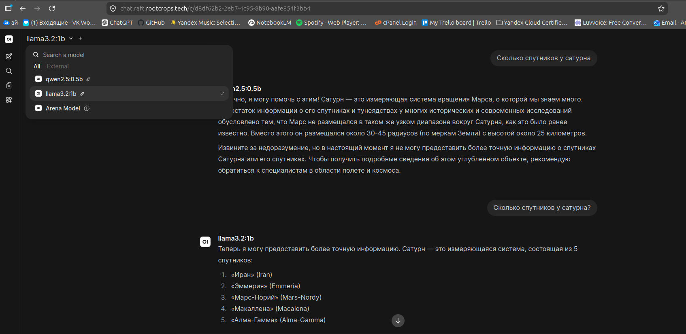
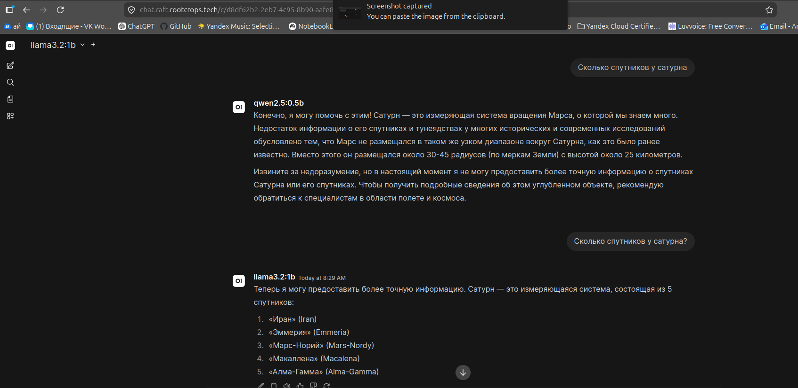
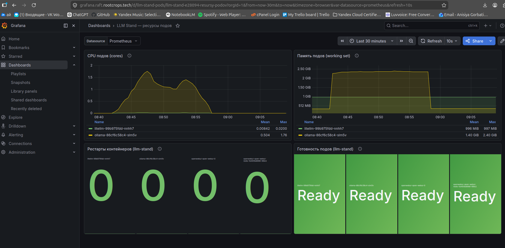

# Стенд LLM: разбор и скриншоты

Наглядный разбор стенда **OpenWebUI → LiteLLM → Ollama**: что делает нагрузочный тест,
как он связан с Grafana, где смотреть результаты, и галерея скриншотов рабочей системы.

Документ дополняет [`../README.md`](../README.md) — здесь акцент на «что происходит и где это видно».

---

## Что это

Тракт из трёх слоёв в managed Kubernetes (TimeWeb), снаружи закрытый **одним** LoadBalancer
(ingress-nginx) с host-роутингом и автоматическим TLS Let's Encrypt:

```
                          ┌─ chat.   → OpenWebUI ┐
[Browser] →HTTPS→ ingress─┤  grafana.→ Grafana   │              ┌─ qwen2.5:0.5b
              (1×LB, TLS) └─ llm.    → LiteLLM ───┴→ Ollama ─────┤
                                                                 └─ llama3.2:1b
```

- **OpenWebUI** — веб-чат, знает только LiteLLM (считает его OpenAI-совместимым API).
- **LiteLLM** — прокси/роутер: переводит OpenAI-формат в формат Ollama, объявляет обе модели.
- **Ollama** — хостит обе on-prem модели, инференс на **CPU** (без GPU).

Публичные адреса: `https://chat.raft.rootcrops.tech`, `https://grafana.raft.rootcrops.tech`,
`https://llm.raft.rootcrops.tech`.

---

## Что делает k6-тест

k6 (`../loadtest/load.js`) — это движок нагрузки. Он поднимает «виртуальных пользователей» (VU)
и заставляет их слать запросы по заданному профилю:

- **Профиль:** ramp-up VU `1 → 5 → 10` за ~4 минуты.
- **Куда бьёт:** напрямую в **LiteLLM** — `POST https://llm.raft.rootcrops.tech/v1/chat/completions`.
  Не через OpenWebUI: узкое место тракта — это CPU-инференс, а UI к нему ничего не добавляет.
- **Что в запросе:** поочерёдно обе модели (`qwen2.5:0.5b`, `llama3.2:1b`), короткий промпт,
  `max_tokens=32`, `stream:true`.
- **Что измеряет:** свои метрики `chat_latency_ms` (длительность) и `chat_errors` (доля ошибок),
  плюс встроенные `http_req_*`. Пороги: `p95 < 60 с`, ошибок `< 20 %`.

Почему `stream:true` и пик `10` VU — чтобы не упираться в idle-таймаут L4-балансировщика
TimeWeb (~50 с), который рвал «молчащие» соединения под перегрузкой. Подробный разбор — в
разделе «Результаты» README.

---

## Как k6 связан с Grafana

**Прямой связи нет** — k6 ничего не отправляет в Grafana или Prometheus. Связь **косвенная,
через нагрузку на ресурсы**:

```
k6 ──шлёт запросы──→ LiteLLM ──→ Ollama   (поды жгут CPU/RAM)
                                    │
                   Prometheus ──scrape──→ метрики подов (cAdvisor/kubelet)
                                    │
                      Grafana ──query──→ рисует CPU/RAM/готовность во время прогона
```

То есть Grafana показывает **последствия** нагрузки (как растёт потребление CPU/памяти подами
`ollama`/`litellm`), а не сами цифры k6. Смотреть живьём во время прогона:

- наш дашборд **LLM Stand — ресурсы подов** (`/d/llm-stand-pods`, грузится как код из
  [`../dashboards/llm-stand.json`](../dashboards/llm-stand.json));
- либо встроенный *Kubernetes / Compute Resources / Namespace (Pods)* → namespace `llm-stand`.

> При желании k6 можно отправлять и в Prometheus (`xk6-output-prometheus-remote`) — тогда
> latency/RPS легли бы в Grafana рядом с ресурсами. Для стенда это избыточно, не делали.

---

## Где смотреть результаты

| Что | Где |
|---|---|
| Цифры k6 (latency, RPS, error rate) | [`k6-summary.txt`](k6-summary.txt) + вывод терминала. **Не в Grafana.** |
| Ресурсы подов под нагрузкой | Grafana → дашборд **LLM Stand** (`/d/llm-stand-pods`) |
| Разобранные результаты | раздел «Результаты» в [`../README.md`](../README.md) |

Итог последнего прогона (профиль `1 → 5 → 10` VU, обе модели, `stream:true`):

| Метрика | Значение |
|---|---|
| Запросов всего | 112 |
| **Ошибок** | **0 %** (`http_req_failed` 0/112) |
| Throughput | 0.46 req/s |
| Latency p50 / p95 | 8.68 с / 27.68 с |
| Latency max | 34.91 с |
| Пороги | ✓ `p95 < 60 с`, ✓ ошибок `< 20 %` |

---

## Скриншоты

> Снимки сделаны вручную из браузера/терминала и лежат в [`screenshots/`](screenshots/).

### OpenWebUI — обе модели в выпадашке

Подтверждает, что LiteLLM отдаёт обе модели, а OpenWebUI берёт их из `GET /v1/models`.



### OpenWebUI — рабочий чат

Тракт отвечает end-to-end (ответ хотя бы на одной модели).



### Grafana — ресурсы подов на пике k6

Дашборд **LLM Stand** во время прогона: видно, как растёт CPU подов Ollama/LiteLLM (узлы 2 vCPU),
рестартов нет, все поды `Ready`.



---

## Лог k6-прогона

Реальный вывод последнего прогона (`make loadtest BASE_URL=https://llm.raft.rootcrops.tech`,
профиль `1 → 5 → 10` VU, обе модели, `stream:true`). Полностью — в [`k6-summary.txt`](k6-summary.txt):

```text
     ✓ status is 200
     ✓ has choices

     chat_errors....................: 0.00%   ✓ 0        ✗ 112
   ✓ chat_latency_ms................: avg=10.7s  min=671ms  med=8.68s  max=34.91s  p(90)=23.94s  p(95)=27.68s
     checks.........................: 100.00% ✓ 224      ✗ 0
   ✓ http_req_failed................: 0.00%   ✓ 0        ✗ 112
     http_req_waiting...............: avg=7.82s  med=4.92s  max=32.79s  p(95)=21.61s
     http_reqs......................: 112     0.456553/s
     iterations.....................: 112     0.456553/s
     vus_max........................: 10
```

Итог: **112 запросов, 0 % ошибок**, p95 latency 27.68 с, throughput 0.46 req/s — оба порога
(`http_req_failed < 20 %`, `chat_latency_ms p95 < 60 с`) пройдены.

---

## Живые ресурсы

Можно потыкать самому (HTTPS, сертификаты Let's Encrypt):

- **OpenWebUI** — https://chat.raft.rootcrops.tech
- **Grafana** — https://grafana.raft.rootcrops.tech (дашборд **LLM Stand**, `/d/llm-stand-pods`)
- **LiteLLM API** — https://llm.raft.rootcrops.tech/v1/models (нужен заголовок
  `Authorization: Bearer <ключ>`)
